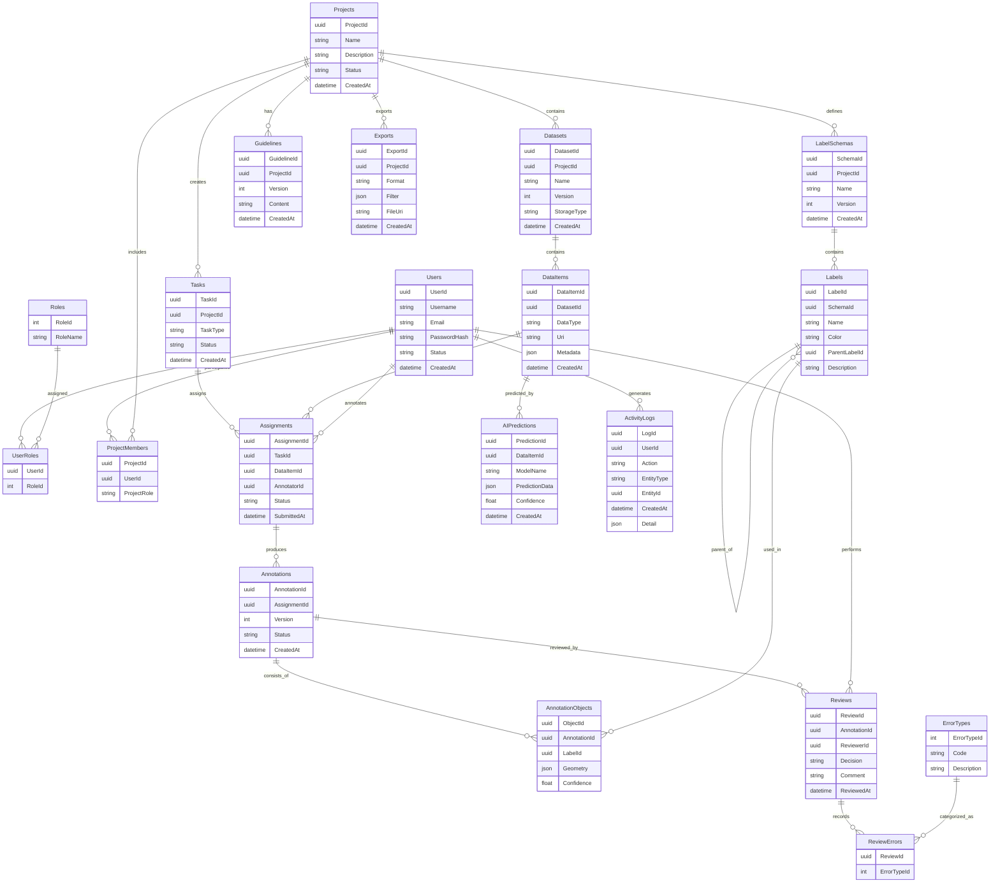

```mermaid
erDiagram
    %% === Core User & Role Entities ===
    Users {
        uuid UserId
        string Username
        string Email
        string PasswordHash
        string Status
        datetime CreatedAt
    }

    Roles {
        int RoleId
        string RoleName
    }

    UserRoles {
        uuid UserId
        int RoleId
    }

    ProjectMembers {
        uuid ProjectId
        uuid UserId
        string ProjectRole
    }

    %% === Project & Dataset ===
    Projects {
        uuid ProjectId
        string Name
        string Description
        string Status
        datetime CreatedAt
    }

    Datasets {
        uuid DatasetId
        uuid ProjectId
        string Name
        int Version
        string StorageType
        datetime CreatedAt
    }

    DataItems {
        uuid DataItemId
        uuid DatasetId
        string DataType
        string Uri
        json Metadata
        datetime CreatedAt
    }

    %% === Label & Guideline ===
    LabelSchemas {
        uuid SchemaId
        uuid ProjectId
        string Name
        int Version
        datetime CreatedAt
    }

    Labels {
        uuid LabelId
        uuid SchemaId
        string Name
        string Color
        uuid ParentLabelId
        string Description
    }

    Guidelines {
        uuid GuidelineId
        uuid ProjectId
        int Version
        string Content
        datetime CreatedAt
    }

    %% === Task & Assignment ===
    Tasks {
        uuid TaskId
        uuid ProjectId
        string TaskType
        string Status
        datetime CreatedAt
    }

    Assignments {
        uuid AssignmentId
        uuid TaskId
        uuid DataItemId
        uuid AnnotatorId
        string Status
        datetime SubmittedAt
    }

    %% === Annotation ===
    Annotations {
        uuid AnnotationId
        uuid AssignmentId
        int Version
        string Status
        datetime CreatedAt
    }

    AnnotationObjects {
        uuid ObjectId
        uuid AnnotationId
        uuid LabelId
        json Geometry
        float Confidence
    }

    %% === Review & Quality Control ===
    Reviews {
        uuid ReviewId
        uuid AnnotationId
        uuid ReviewerId
        string Decision
        string Comment
        datetime ReviewedAt
    }

    ErrorTypes {
        int ErrorTypeId
        string Code
        string Description
    }

    ReviewErrors {
        uuid ReviewId
        int ErrorTypeId
    }

    %% === AI & Export ===
    AIPredictions {
        uuid PredictionId
        uuid DataItemId
        string ModelName
        json PredictionData
        float Confidence
        datetime CreatedAt
    }

    Exports {
        uuid ExportId
        uuid ProjectId
        string Format
        json Filter
        string FileUri
        datetime CreatedAt
    }

    %% === Audit ===
    ActivityLogs {
        uuid LogId
        uuid UserId
        string Action
        string EntityType
        uuid EntityId
        datetime CreatedAt
        json Detail
    }

    %% === Relationships ===
    Users ||--o{ UserRoles : has
    Roles ||--o{ UserRoles : assigned

    Users ||--o{ ProjectMembers : participates
    Projects ||--o{ ProjectMembers : includes

    Projects ||--o{ Datasets : contains
    Datasets ||--o{ DataItems : contains

    Projects ||--o{ LabelSchemas : defines
    LabelSchemas ||--o{ Labels : contains
    Labels ||--o{ Labels : parent_of

    Projects ||--o{ Guidelines : has

    Projects ||--o{ Tasks : creates
    Tasks ||--o{ Assignments : assigns
    DataItems ||--o{ Assignments : labeled_by
    Users ||--o{ Assignments : annotates

    Assignments ||--o{ Annotations : produces
    Annotations ||--o{ AnnotationObjects : consists_of
    Labels ||--o{ AnnotationObjects : used_in

    Annotations ||--o{ Reviews : reviewed_by
    Users ||--o{ Reviews : performs
    Reviews ||--o{ ReviewErrors : records
    ErrorTypes ||--o{ ReviewErrors : categorized_as

    DataItems ||--o{ AIPredictions : predicted_by
    Projects ||--o{ Exports : exports

    Users ||--o{ ActivityLogs : generates
```